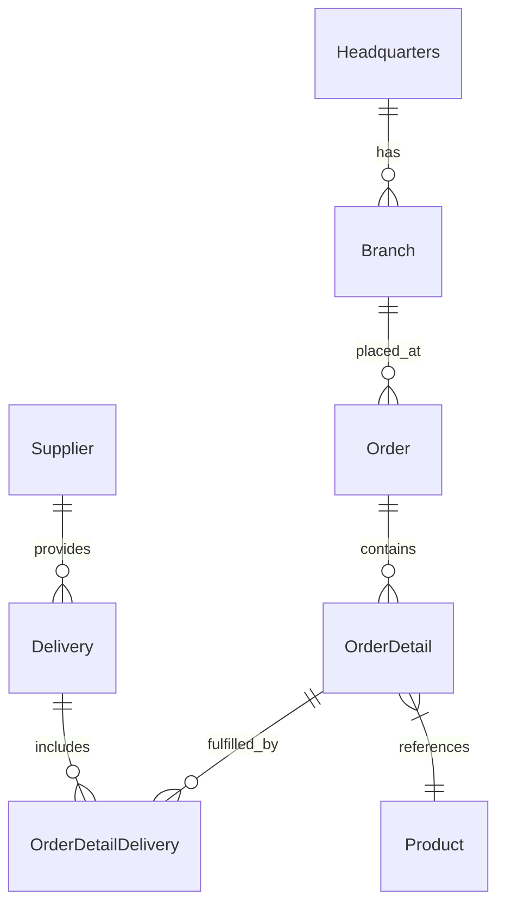
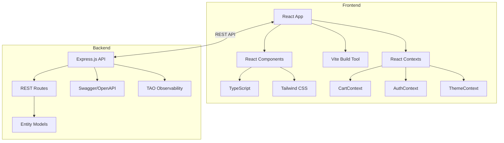

# OctoCAT Supply Chain Management System Architecture

This site is a demo application written in TypeScript. The entire app was created originally from an [ERD diagram](../api/ERD.png) and natural language prompts using Copilot. The frontend was created in the same way, using some of the design ideas in [the design folder](./design/).

The hero image and product images were created by prompting ChatGPT!

## Architecture Overview

The system is a modern supply chain management application built using TypeScript, comprising a backend REST API and a React frontend. It's designed to demonstrate Copilot capabilities using a fairly typical architecture with a little complexity, but not enough to derail demos!

### Backend Architecture
- Express.js API with RESTful endpoints for all entities
- Swagger/OpenAPI documentation integration
- Entity models with proper relationships following an ERD diagram

### Frontend Architecture
- React 19 with TypeScript
- Vite build tool for fast development
- Tailwind CSS for UI styling
- Context-based state management:
  - **CartContext** - Shopping cart state (add/remove items, quantities, totals)
  - **AuthContext** - User authentication state (login/logout, admin detection)
  - **ThemeContext** - Dark/light mode theme switching with localStorage persistence

### DevOps Integration
- Docker/Docker Compose for containerization

## ERD

## Component Architecture

## Frontend Components

| Component | Description |
|-----------|-------------|
| `Navigation` | Header with nav links, cart icon, theme toggle |
| `Products` | Product catalog with grid display |
| `Cart` | Shopping cart with quantity controls, coupons, order summary |
| `Login` | User authentication form |
| `AdminProducts` | Admin panel for product management |
| `Welcome` | Landing page hero section |
| `Footer` | Site footer with links |
| `About` | About page content |

## Key Features

- Complete REST APIs for all supply chain entities
- Detailed OpenAPI documentation, generated by Copilot
- Modern React UI with responsive design, generated by Copilot using images
- **Shopping Cart** with quantity management, coupon codes (SAVE5, SAVE10), and order summary
- **User Authentication** with admin role detection (emails ending in @github.com)
- **Dark/Light Theme** with localStorage persistence
- Containerization for consistent deployment, generated by Copilot